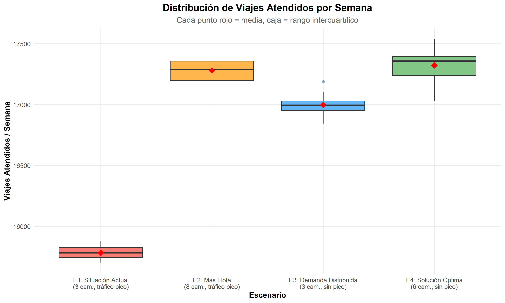
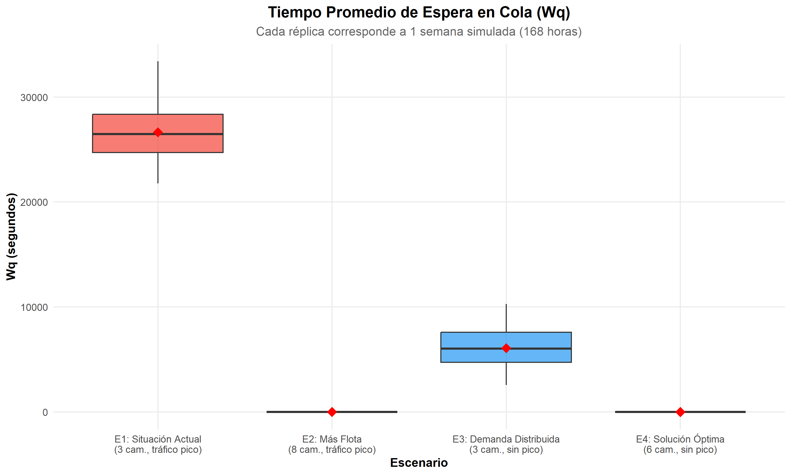
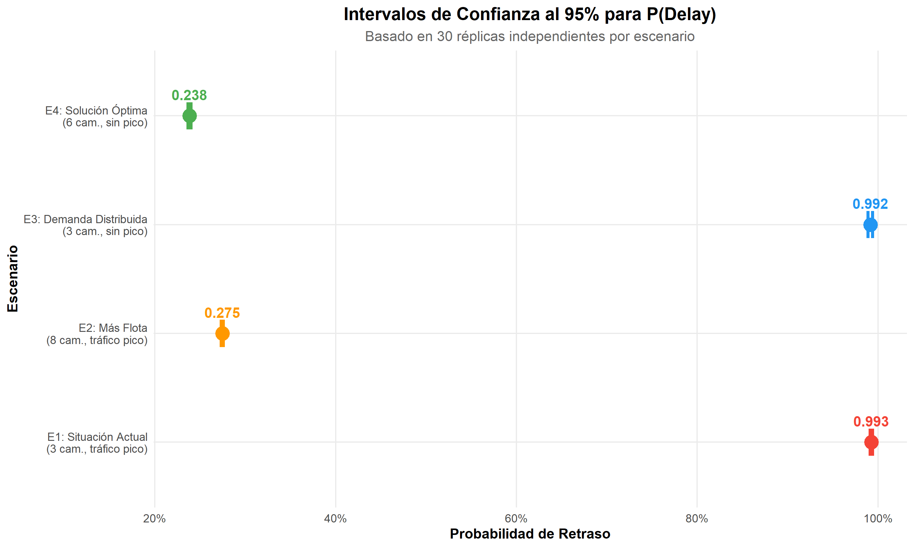
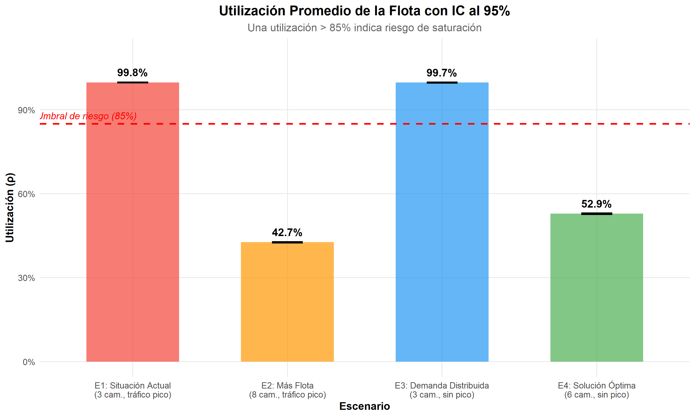
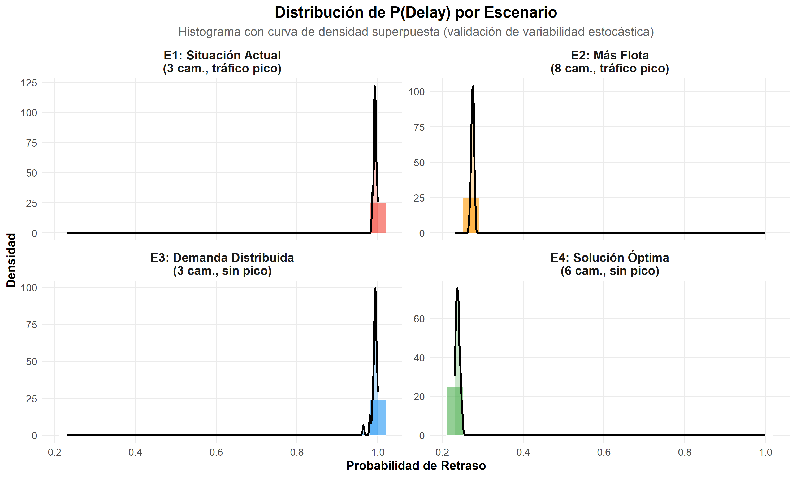
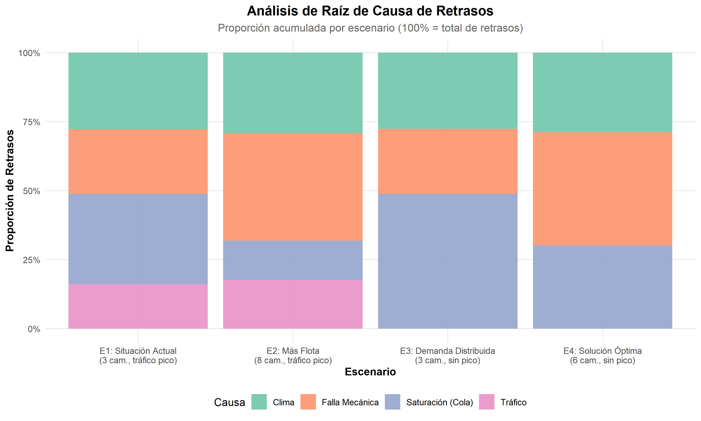
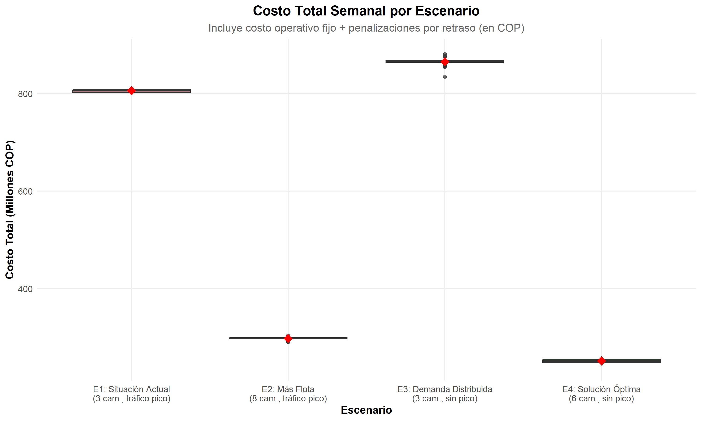
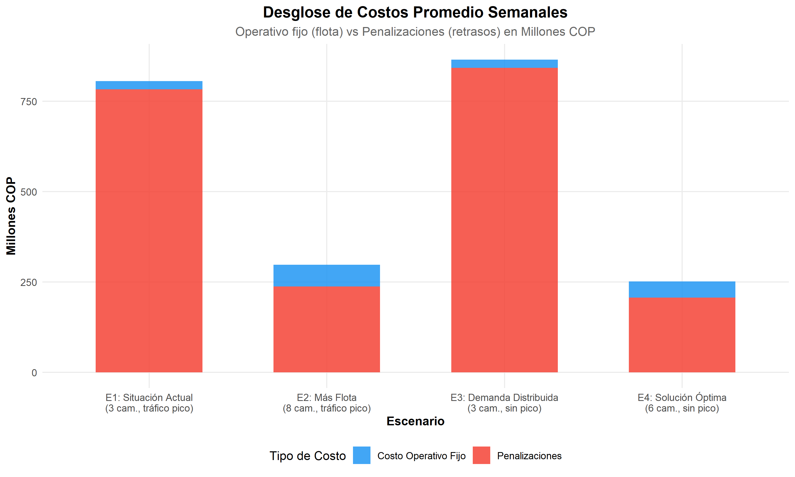
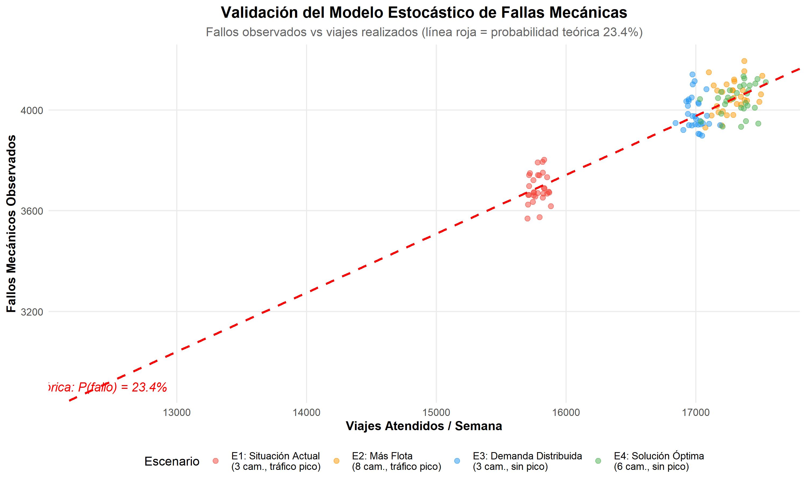
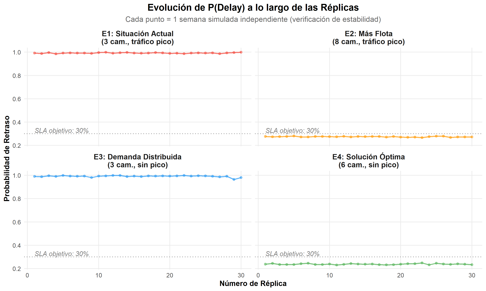

# Carga y Preparación de Datos


``` r
# Cargar resultados desde el CSV completo
df_full <- read.csv("resultados/resultados.csv", stringsAsFactors = FALSE)

# Filtrar SOLO los 4 escenarios actuales (descartar ejecuciones antiguas)
escenarios_actuales <- c("E1_situacion_actual", "E2_mas_camiones",
                         "E3_demanda_distribuida", "E4_solucion_optima")
df <- df_full %>% filter(escenario %in% escenarios_actuales)

# Ordenar escenarios para que la comparativa sea progresiva E1 -> E4
df$escenario <- factor(df$escenario, levels = escenarios_actuales)

cat("Total de registros cargados:", nrow(df_full), "\n")
```

```
## Total de registros cargados: 120
```

``` r
cat("Registros de escenarios actuales:", nrow(df), "\n")
```

```
## Registros de escenarios actuales: 120
```

``` r
cat("Escenarios:", paste(unique(df$escenario), collapse = ", "), "\n")
```

```
## Escenarios: E1_situacion_actual, E2_mas_camiones, E3_demanda_distribuida, E4_solucion_optima
```

# Diseño Experimental

## Condiciones Iniciales y Parámetros


``` r
diseno <- data.frame(
  Escenario = c("E1: Situación Actual", "E2: Más Flota",
                "E3: Demanda Distribuida", "E4: Solución Óptima"),
  Camiones = c(3, 8, 3, 6),
  Multiplicador_Lambda = c("×850", "×850", "×850", "×850"),
  Trafico = c("Pico (1.5x tarde)", "Pico (1.5x tarde)",
              "Sin pico (1.0x)", "Sin pico (1.0x)"),
  Replicas = c(30, 30, 30, 30),
  Duracion = c("168 h (1 semana)", "168 h (1 semana)",
               "168 h (1 semana)", "168 h (1 semana)"),
  Objetivo = c("Representar el problema: sistema saturado (ρ ≈ 0.85) con flota mínima y alta demanda",
               "Intervención 1: ¿Cuánto reduce Wq agregar más camiones (8 cam.)?",
               "Intervención 2: ¿Cuánto reduce Wq distribuir despachos fuera de pico?",
               "Solución combinada: 6 camiones + despacho distribuido (equilibrio óptimo)")
)

diseno %>%
  kable(col.names = c("Escenario", "Camiones (c)", "Demanda (λ)", "Tráfico",
                       "Réplicas", "Duración", "Objetivo"),
        caption = "Tabla 1: Diseño Experimental — Escenarios de Optimización del Tiempo de Espera") %>%
  kable_styling(bootstrap_options = c("striped", "hover", "condensed"),
                full_width = TRUE) %>%
  row_spec(0, bold = TRUE, background = "#2196F3", color = "white") %>%
  row_spec(1, background = "#FFEBEE") %>%   # E1 rojo claro = problema
  row_spec(4, background = "#E8F5E9")       # E4 verde claro = solucion
```

<table class="table table-striped table-hover table-condensed" style="margin-left: auto; margin-right: auto;">
<caption>Tabla 1: Diseño Experimental — Escenarios de Optimización del Tiempo de Espera</caption>
 <thead>
  <tr>
   <th style="text-align:left;font-weight: bold;color: white !important;background-color: rgba(33, 150, 243, 255) !important;"> Escenario </th>
   <th style="text-align:right;font-weight: bold;color: white !important;background-color: rgba(33, 150, 243, 255) !important;"> Camiones (c) </th>
   <th style="text-align:left;font-weight: bold;color: white !important;background-color: rgba(33, 150, 243, 255) !important;"> Demanda (λ) </th>
   <th style="text-align:left;font-weight: bold;color: white !important;background-color: rgba(33, 150, 243, 255) !important;"> Tráfico </th>
   <th style="text-align:right;font-weight: bold;color: white !important;background-color: rgba(33, 150, 243, 255) !important;"> Réplicas </th>
   <th style="text-align:left;font-weight: bold;color: white !important;background-color: rgba(33, 150, 243, 255) !important;"> Duración </th>
   <th style="text-align:left;font-weight: bold;color: white !important;background-color: rgba(33, 150, 243, 255) !important;"> Objetivo </th>
  </tr>
 </thead>
<tbody>
  <tr>
   <td style="text-align:left;background-color: rgba(255, 235, 238, 255) !important;"> E1: Situación Actual </td>
   <td style="text-align:right;background-color: rgba(255, 235, 238, 255) !important;"> 3 </td>
   <td style="text-align:left;background-color: rgba(255, 235, 238, 255) !important;"> ×850 </td>
   <td style="text-align:left;background-color: rgba(255, 235, 238, 255) !important;"> Pico (1.5x tarde) </td>
   <td style="text-align:right;background-color: rgba(255, 235, 238, 255) !important;"> 30 </td>
   <td style="text-align:left;background-color: rgba(255, 235, 238, 255) !important;"> 168 h (1 semana) </td>
   <td style="text-align:left;background-color: rgba(255, 235, 238, 255) !important;"> Representar el problema: sistema saturado (ρ ≈ 0.85) con flota mínima y alta demanda </td>
  </tr>
  <tr>
   <td style="text-align:left;"> E2: Más Flota </td>
   <td style="text-align:right;"> 8 </td>
   <td style="text-align:left;"> ×850 </td>
   <td style="text-align:left;"> Pico (1.5x tarde) </td>
   <td style="text-align:right;"> 30 </td>
   <td style="text-align:left;"> 168 h (1 semana) </td>
   <td style="text-align:left;"> Intervención 1: ¿Cuánto reduce Wq agregar más camiones (8 cam.)? </td>
  </tr>
  <tr>
   <td style="text-align:left;"> E3: Demanda Distribuida </td>
   <td style="text-align:right;"> 3 </td>
   <td style="text-align:left;"> ×850 </td>
   <td style="text-align:left;"> Sin pico (1.0x) </td>
   <td style="text-align:right;"> 30 </td>
   <td style="text-align:left;"> 168 h (1 semana) </td>
   <td style="text-align:left;"> Intervención 2: ¿Cuánto reduce Wq distribuir despachos fuera de pico? </td>
  </tr>
  <tr>
   <td style="text-align:left;background-color: rgba(232, 245, 233, 255) !important;"> E4: Solución Óptima </td>
   <td style="text-align:right;background-color: rgba(232, 245, 233, 255) !important;"> 6 </td>
   <td style="text-align:left;background-color: rgba(232, 245, 233, 255) !important;"> ×850 </td>
   <td style="text-align:left;background-color: rgba(232, 245, 233, 255) !important;"> Sin pico (1.0x) </td>
   <td style="text-align:right;background-color: rgba(232, 245, 233, 255) !important;"> 30 </td>
   <td style="text-align:left;background-color: rgba(232, 245, 233, 255) !important;"> 168 h (1 semana) </td>
   <td style="text-align:left;background-color: rgba(232, 245, 233, 255) !important;"> Solución combinada: 6 camiones + despacho distribuido (equilibrio óptimo) </td>
  </tr>
</tbody>
</table>

## Parámetros Estocásticos del Modelo


``` r
params <- data.frame(
  Parametro = c("Probabilidad de Falla Mecánica",
                "Tiempo extra por falla (media)",
                "Probabilidad de evento climático",
                "Umbral temperatura para fallas",
                "Umbral humedad para fricción",
                "Multiplicador tráfico (Mañana 07-09h)",
                "Multiplicador tráfico (Mediodía 12-14h)",
                "Multiplicador tráfico (Tarde 17-19h)",
                "Costo penalización por retraso",
                "Costo operativo fijo por camión/hora",
                "Distribución tiempo de servicio",
                "Coeficiente de variación (CV)"),
  Valor = c("23.4%", "36.0 seg (Exponencial)",
            "36.2%", "> 25°C (+5%/°C)",
            "> 60% (hasta +20% tiempo)", "1.3x", "1.1x", "1.5x",
            "$50,000 COP", "$45,000 COP",
            "Log-normal (M/G/c)", "0.5"),
  Fuente = c("Dataset Kaggle", "Dataset Kaggle",
             "Dataset Kaggle", "Modelo térmico simplificado",
             "Modelo de fricción operativa",
             "Urban Mobility Report (TTI)", "Urban Mobility Report (TTI)",
             "Urban Mobility Report (TTI)",
             "SICE-TAC (Min. Transporte Colombia)",
             "SICE-TAC (Min. Transporte Colombia)",
             "Calibración estadística", "Supuesto del modelo")
)

params %>%
  kable(caption = "Tabla 2: Parámetros Estocásticos del Modelo") %>%
  kable_styling(bootstrap_options = c("striped", "hover"),
                full_width = TRUE) %>%
  row_spec(0, bold = TRUE, background = "#FF9800", color = "white")
```

<table class="table table-striped table-hover" style="margin-left: auto; margin-right: auto;">
<caption>Tabla 2: Parámetros Estocásticos del Modelo</caption>
 <thead>
  <tr>
   <th style="text-align:left;font-weight: bold;color: white !important;background-color: rgba(255, 152, 0, 255) !important;"> Parametro </th>
   <th style="text-align:left;font-weight: bold;color: white !important;background-color: rgba(255, 152, 0, 255) !important;"> Valor </th>
   <th style="text-align:left;font-weight: bold;color: white !important;background-color: rgba(255, 152, 0, 255) !important;"> Fuente </th>
  </tr>
 </thead>
<tbody>
  <tr>
   <td style="text-align:left;"> Probabilidad de Falla Mecánica </td>
   <td style="text-align:left;"> 23.4% </td>
   <td style="text-align:left;"> Dataset Kaggle </td>
  </tr>
  <tr>
   <td style="text-align:left;"> Tiempo extra por falla (media) </td>
   <td style="text-align:left;"> 36.0 seg (Exponencial) </td>
   <td style="text-align:left;"> Dataset Kaggle </td>
  </tr>
  <tr>
   <td style="text-align:left;"> Probabilidad de evento climático </td>
   <td style="text-align:left;"> 36.2% </td>
   <td style="text-align:left;"> Dataset Kaggle </td>
  </tr>
  <tr>
   <td style="text-align:left;"> Umbral temperatura para fallas </td>
   <td style="text-align:left;"> &gt; 25°C (+5%/°C) </td>
   <td style="text-align:left;"> Modelo térmico simplificado </td>
  </tr>
  <tr>
   <td style="text-align:left;"> Umbral humedad para fricción </td>
   <td style="text-align:left;"> &gt; 60% (hasta +20% tiempo) </td>
   <td style="text-align:left;"> Modelo de fricción operativa </td>
  </tr>
  <tr>
   <td style="text-align:left;"> Multiplicador tráfico (Mañana 07-09h) </td>
   <td style="text-align:left;"> 1.3x </td>
   <td style="text-align:left;"> Urban Mobility Report (TTI) </td>
  </tr>
  <tr>
   <td style="text-align:left;"> Multiplicador tráfico (Mediodía 12-14h) </td>
   <td style="text-align:left;"> 1.1x </td>
   <td style="text-align:left;"> Urban Mobility Report (TTI) </td>
  </tr>
  <tr>
   <td style="text-align:left;"> Multiplicador tráfico (Tarde 17-19h) </td>
   <td style="text-align:left;"> 1.5x </td>
   <td style="text-align:left;"> Urban Mobility Report (TTI) </td>
  </tr>
  <tr>
   <td style="text-align:left;"> Costo penalización por retraso </td>
   <td style="text-align:left;"> $50,000 COP </td>
   <td style="text-align:left;"> SICE-TAC (Min. Transporte Colombia) </td>
  </tr>
  <tr>
   <td style="text-align:left;"> Costo operativo fijo por camión/hora </td>
   <td style="text-align:left;"> $45,000 COP </td>
   <td style="text-align:left;"> SICE-TAC (Min. Transporte Colombia) </td>
  </tr>
  <tr>
   <td style="text-align:left;"> Distribución tiempo de servicio </td>
   <td style="text-align:left;"> Log-normal (M/G/c) </td>
   <td style="text-align:left;"> Calibración estadística </td>
  </tr>
  <tr>
   <td style="text-align:left;"> Coeficiente de variación (CV) </td>
   <td style="text-align:left;"> 0.5 </td>
   <td style="text-align:left;"> Supuesto del modelo </td>
  </tr>
</tbody>
</table>

# Resultados de la Simulación

## Estadísticas Descriptivas por Escenario


``` r
stats <- df %>%
  group_by(escenario) %>%
  summarise(
    n = n(),
    Wq_media = mean(Wq_mean, na.rm = TRUE),
    Wq_sd = sd(Wq_mean, na.rm = TRUE),
    P_delay_media = mean(P_delay, na.rm = TRUE),
    P_delay_sd = sd(P_delay, na.rm = TRUE),
    Utilizacion_media = mean(utilizacion, na.rm = TRUE),
    Utilizacion_sd = sd(utilizacion, na.rm = TRUE),
    Viajes_media = mean(pedidos_atendidos, na.rm = TRUE),
    Retrasados_media = mean(pedidos_retrasados, na.rm = TRUE),
    Fallos_media = mean(num_fallos, na.rm = TRUE),
    Costo_media = mean(costo_total, na.rm = TRUE),
    .groups = "drop"
  ) %>%
  mutate(across(where(is.numeric), ~round(., 2)))

stats %>%
  kable(col.names = c("Escenario", "n", "Wq (seg)", "Wq SD",
                       "P(Delay)", "P(Delay) SD",
                       "Utilización", "Util. SD",
                       "Viajes/sem", "Retrasados/sem",
                       "Fallos/sem", "Costo COP"),
        caption = "Tabla 3: Resumen Estadístico por Escenario") %>%
  kable_styling(bootstrap_options = c("striped", "hover", "condensed"),
                full_width = TRUE, font_size = 11) %>%
  row_spec(0, bold = TRUE, background = "#4CAF50", color = "white")
```

<table class="table table-striped table-hover table-condensed" style="font-size: 11px; margin-left: auto; margin-right: auto;">
<caption style="font-size: initial !important;">Tabla 3: Resumen Estadístico por Escenario</caption>
 <thead>
  <tr>
   <th style="text-align:left;font-weight: bold;color: white !important;background-color: rgba(76, 175, 80, 255) !important;"> Escenario </th>
   <th style="text-align:right;font-weight: bold;color: white !important;background-color: rgba(76, 175, 80, 255) !important;"> n </th>
   <th style="text-align:right;font-weight: bold;color: white !important;background-color: rgba(76, 175, 80, 255) !important;"> Wq (seg) </th>
   <th style="text-align:right;font-weight: bold;color: white !important;background-color: rgba(76, 175, 80, 255) !important;"> Wq SD </th>
   <th style="text-align:right;font-weight: bold;color: white !important;background-color: rgba(76, 175, 80, 255) !important;"> P(Delay) </th>
   <th style="text-align:right;font-weight: bold;color: white !important;background-color: rgba(76, 175, 80, 255) !important;"> P(Delay) SD </th>
   <th style="text-align:right;font-weight: bold;color: white !important;background-color: rgba(76, 175, 80, 255) !important;"> Utilización </th>
   <th style="text-align:right;font-weight: bold;color: white !important;background-color: rgba(76, 175, 80, 255) !important;"> Util. SD </th>
   <th style="text-align:right;font-weight: bold;color: white !important;background-color: rgba(76, 175, 80, 255) !important;"> Viajes/sem </th>
   <th style="text-align:right;font-weight: bold;color: white !important;background-color: rgba(76, 175, 80, 255) !important;"> Retrasados/sem </th>
   <th style="text-align:right;font-weight: bold;color: white !important;background-color: rgba(76, 175, 80, 255) !important;"> Fallos/sem </th>
   <th style="text-align:right;font-weight: bold;color: white !important;background-color: rgba(76, 175, 80, 255) !important;"> Costo COP </th>
  </tr>
 </thead>
<tbody>
  <tr>
   <td style="text-align:left;"> E1_situacion_actual </td>
   <td style="text-align:right;"> 30 </td>
   <td style="text-align:right;"> 26645.85 </td>
   <td style="text-align:right;"> 2909.95 </td>
   <td style="text-align:right;"> 0.99 </td>
   <td style="text-align:right;"> 0.00 </td>
   <td style="text-align:right;"> 1.00 </td>
   <td style="text-align:right;"> 0 </td>
   <td style="text-align:right;"> 15784.03 </td>
   <td style="text-align:right;"> 15669.67 </td>
   <td style="text-align:right;"> 3689.20 </td>
   <td style="text-align:right;"> 806163333 </td>
  </tr>
  <tr>
   <td style="text-align:left;"> E2_mas_camiones </td>
   <td style="text-align:right;"> 30 </td>
   <td style="text-align:right;"> 0.84 </td>
   <td style="text-align:right;"> 0.14 </td>
   <td style="text-align:right;"> 0.27 </td>
   <td style="text-align:right;"> 0.00 </td>
   <td style="text-align:right;"> 0.43 </td>
   <td style="text-align:right;"> 0 </td>
   <td style="text-align:right;"> 17280.43 </td>
   <td style="text-align:right;"> 4746.27 </td>
   <td style="text-align:right;"> 4054.27 </td>
   <td style="text-align:right;"> 297793333 </td>
  </tr>
  <tr>
   <td style="text-align:left;"> E3_demanda_distribuida </td>
   <td style="text-align:right;"> 30 </td>
   <td style="text-align:right;"> 6078.32 </td>
   <td style="text-align:right;"> 2096.59 </td>
   <td style="text-align:right;"> 0.99 </td>
   <td style="text-align:right;"> 0.01 </td>
   <td style="text-align:right;"> 1.00 </td>
   <td style="text-align:right;"> 0 </td>
   <td style="text-align:right;"> 16998.77 </td>
   <td style="text-align:right;"> 16855.47 </td>
   <td style="text-align:right;"> 3987.70 </td>
   <td style="text-align:right;"> 865453333 </td>
  </tr>
  <tr>
   <td style="text-align:left;"> E4_solucion_optima </td>
   <td style="text-align:right;"> 30 </td>
   <td style="text-align:right;"> 3.89 </td>
   <td style="text-align:right;"> 0.43 </td>
   <td style="text-align:right;"> 0.24 </td>
   <td style="text-align:right;"> 0.00 </td>
   <td style="text-align:right;"> 0.53 </td>
   <td style="text-align:right;"> 0 </td>
   <td style="text-align:right;"> 17323.50 </td>
   <td style="text-align:right;"> 4128.37 </td>
   <td style="text-align:right;"> 4042.67 </td>
   <td style="text-align:right;"> 251778333 </td>
  </tr>
</tbody>
</table>

## Gráfico 1: Comparativa de Viajes Atendidos por Escenario


``` r
ggplot(df, aes(x = escenario, y = pedidos_atendidos, fill = escenario)) +
  geom_boxplot(alpha = 0.7, outlier.shape = 21) +
  stat_summary(fun = mean, geom = "point", shape = 18, size = 4, color = "red") +
  scale_fill_manual(values = colores_esc) +
  scale_x_discrete(labels = etiquetas_esc) +
  labs(
    title = "Distribución de Viajes Atendidos por Semana",
    subtitle = "Cada punto rojo = media; caja = rango intercuartílico",
    x = "Escenario", y = "Viajes Atendidos / Semana"
  ) +
  theme_sim + theme(legend.position = "none")
```

<div class="figure" style="text-align: center">

<p class="caption">Figura 1: Distribución del número de viajes atendidos por semana simulada en cada escenario.</p>
</div>

## Gráfico 2: Boxplot de Tiempo de Espera en Cola (Wq)


``` r
ggplot(df, aes(x = escenario, y = Wq_mean, fill = escenario)) +
  geom_boxplot(alpha = 0.7) +
  stat_summary(fun = mean, geom = "point", shape = 18, size = 4, color = "red") +
  scale_fill_manual(values = colores_esc) +
  scale_x_discrete(labels = etiquetas_esc) +
  labs(
    title = "Tiempo Promedio de Espera en Cola (Wq)",
    subtitle = "Cada réplica corresponde a 1 semana simulada (168 horas)",
    x = "Escenario", y = "Wq (segundos)"
  ) +
  theme_sim + theme(legend.position = "none")
```

<div class="figure" style="text-align: center">

<p class="caption">Figura 2: Distribución del tiempo promedio de espera en cola por réplica.</p>
</div>

## Gráfico 3: Intervalos de Confianza al 95% para P(Delay)


``` r
ic_pdelay <- df %>%
  group_by(escenario) %>%
  summarise(
    media = mean(P_delay),
    sd = sd(P_delay),
    n = n(),
    se = sd / sqrt(n),
    ic_inf = media - qt(0.975, n-1) * se,
    ic_sup = media + qt(0.975, n-1) * se,
    .groups = "drop"
  )

ggplot(ic_pdelay, aes(x = escenario, y = media, color = escenario)) +
  geom_point(size = 5) +
  geom_errorbar(aes(ymin = ic_inf, ymax = ic_sup), width = 0.25, linewidth = 1.2) +
  geom_text(aes(label = sprintf("%.3f", media)), vjust = -1.5, fontface = "bold", size = 4) +
  scale_color_manual(values = colores_esc) +
  scale_x_discrete(labels = etiquetas_esc) +
  scale_y_continuous(labels = scales::percent_format()) +
  labs(
    title = "Intervalos de Confianza al 95% para P(Delay)",
    subtitle = "Basado en 30 réplicas independientes por escenario",
    x = "Escenario", y = "Probabilidad de Retraso"
  ) +
  theme_sim + theme(legend.position = "none") +
  coord_flip()
```

<div class="figure" style="text-align: center">

<p class="caption">Figura 3: Intervalos de confianza al 95% para la probabilidad de retraso en cada escenario.</p>
</div>

## Gráfico 4: Intervalos de Confianza al 95% para Utilización


``` r
ic_util <- df %>%
  group_by(escenario) %>%
  summarise(
    media = mean(utilizacion),
    sd = sd(utilizacion),
    n = n(),
    se = sd / sqrt(n),
    ic_inf = media - qt(0.975, n-1) * se,
    ic_sup = media + qt(0.975, n-1) * se,
    .groups = "drop"
  )

ggplot(ic_util, aes(x = escenario, y = media, fill = escenario)) +
  geom_col(alpha = 0.7, width = 0.6) +
  geom_errorbar(aes(ymin = ic_inf, ymax = ic_sup), width = 0.2, linewidth = 0.8) +
  geom_text(aes(label = sprintf("%.1f%%", media * 100)), vjust = -0.8, fontface = "bold") +
  scale_fill_manual(values = colores_esc) +
  scale_x_discrete(labels = etiquetas_esc) +
  scale_y_continuous(labels = scales::percent_format(), limits = c(0, 1.1)) +
  labs(
    title = "Utilización Promedio de la Flota con IC al 95%",
    subtitle = "Una utilización > 85% indica riesgo de saturación",
    x = "Escenario", y = "Utilización (ρ)"
  ) +
  geom_hline(yintercept = 0.85, linetype = "dashed", color = "red", linewidth = 0.8) +
  annotate("text", x = 0.7, y = 0.88, label = "Umbral de riesgo (85%)",
           color = "red", fontface = "italic", size = 3.5) +
  theme_sim + theme(legend.position = "none")
```

<div class="figure" style="text-align: center">

<p class="caption">Figura 4: Intervalos de confianza al 95% para la utilización promedio de la flota.</p>
</div>

## Gráfico 5: Distribución de Probabilidad de Retraso (Histograma + Densidad)


``` r
ggplot(df, aes(x = P_delay, fill = escenario)) +
  geom_histogram(aes(y = after_stat(density)), bins = 20, alpha = 0.6,
                 color = "white", linewidth = 0.3) +
  geom_density(alpha = 0.3, linewidth = 0.8) +
  scale_fill_manual(values = colores_esc, labels = etiquetas_esc) +
  facet_wrap(~escenario, scales = "free_y", ncol = 2,
             labeller = labeller(escenario = etiquetas_esc)) +
  labs(
    title = "Distribución de P(Delay) por Escenario",
    subtitle = "Histograma con curva de densidad superpuesta (validación de variabilidad estocástica)",
    x = "Probabilidad de Retraso", y = "Densidad"
  ) +
  theme_sim + theme(legend.position = "none")
```

<div class="figure" style="text-align: center">

<p class="caption">Figura 5: Distribución de la probabilidad de retraso para cada escenario.</p>
</div>

## Gráfico 6: Análisis de Causas de Retraso (Raíz de Causa)


``` r
causas <- df %>%
  group_by(escenario) %>%
  summarise(
    Mecanico = sum(retrasos_mecanico, na.rm = TRUE),
    Clima = sum(retrasos_clima, na.rm = TRUE),
    Trafico = sum(retrasos_trafico, na.rm = TRUE),
    Saturacion = sum(retrasos_saturacion, na.rm = TRUE),
    .groups = "drop"
  ) %>%
  pivot_longer(cols = c(Mecanico, Clima, Trafico, Saturacion),
               names_to = "Causa", values_to = "Cantidad")

ggplot(causas, aes(x = escenario, y = Cantidad, fill = Causa)) +
  geom_col(position = "fill", alpha = 0.85) +
  scale_fill_brewer(palette = "Set2",
                    labels = c("Clima", "Falla Mecánica",
                               "Saturación (Cola)", "Tráfico")) +
  scale_x_discrete(labels = etiquetas_esc) +
  scale_y_continuous(labels = scales::percent_format()) +
  labs(
    title = "Análisis de Raíz de Causa de Retrasos",
    subtitle = "Proporción acumulada por escenario (100% = total de retrasos)",
    x = "Escenario", y = "Proporción de Retrasos", fill = "Causa"
  ) +
  theme_sim
```

<div class="figure" style="text-align: center">

<p class="caption">Figura 6: Proporción de las causas principales de retraso por escenario.</p>
</div>

## Gráfico 7: Comparativa de Costos Totales (COP)


``` r
ggplot(df, aes(x = escenario, y = costo_total / 1e6, fill = escenario)) +
  geom_boxplot(alpha = 0.7) +
  stat_summary(fun = mean, geom = "point", shape = 18, size = 4, color = "red") +
  scale_fill_manual(values = colores_esc) +
  scale_x_discrete(labels = etiquetas_esc) +
  labs(
    title = "Costo Total Semanal por Escenario",
    subtitle = "Incluye costo operativo fijo + penalizaciones por retraso (en COP)",
    x = "Escenario", y = "Costo Total (Millones COP)"
  ) +
  theme_sim + theme(legend.position = "none")
```

<div class="figure" style="text-align: center">

<p class="caption">Figura 7: Distribución de costos totales semanales por escenario en COP.</p>
</div>

## Gráfico 8: Desglose de Costos (Operativo vs Penalizaciones)


``` r
costos_desglose <- df %>%
  group_by(escenario) %>%
  summarise(
    Operativo_Fijo = mean(costo_operativo_fijo, na.rm = TRUE) / 1e6,
    Penalizaciones = mean(costo_penalizaciones, na.rm = TRUE) / 1e6,
    .groups = "drop"
  ) %>%
  pivot_longer(cols = c(Operativo_Fijo, Penalizaciones),
               names_to = "Tipo", values_to = "Millones_COP")

ggplot(costos_desglose, aes(x = escenario, y = Millones_COP, fill = Tipo)) +
  geom_col(position = "stack", alpha = 0.85, width = 0.6) +
  scale_fill_manual(values = c("Operativo_Fijo" = "#2196F3",
                                "Penalizaciones" = "#F44336"),
                    labels = c("Costo Operativo Fijo", "Penalizaciones")) +
  scale_x_discrete(labels = etiquetas_esc) +
  labs(
    title = "Desglose de Costos Promedio Semanales",
    subtitle = "Operativo fijo (flota) vs Penalizaciones (retrasos) en Millones COP",
    x = "Escenario", y = "Millones COP", fill = "Tipo de Costo"
  ) +
  theme_sim
```

<div class="figure" style="text-align: center">

<p class="caption">Figura 8: Proporción de costos operativos fijos vs penalizaciones por retraso.</p>
</div>

## Gráfico 9: Viabilidad de Elementos Estocásticos (Fallos Mecánicos)


``` r
fallos_vs_viajes <- df %>%
  mutate(tasa_fallos_obs = num_fallos / pedidos_atendidos)

ggplot(fallos_vs_viajes, aes(x = pedidos_atendidos, y = num_fallos, color = escenario)) +
  geom_point(alpha = 0.5, size = 2) +
  geom_abline(intercept = 0, slope = 0.234, linetype = "dashed",
              color = "red", linewidth = 1) +
  annotate("text", x = max(df$pedidos_atendidos) * 0.7,
           y = max(df$pedidos_atendidos) * 0.7 * 0.234 + 30,
           label = "Línea teórica: P(fallo) = 23.4%",
           color = "red", fontface = "italic", size = 4) +
  scale_color_manual(values = colores_esc, labels = etiquetas_esc) +
  labs(
    title = "Validación del Modelo Estocástico de Fallas Mecánicas",
    subtitle = "Fallos observados vs viajes realizados (línea roja = probabilidad teórica 23.4%)",
    x = "Viajes Atendidos / Semana",
    y = "Fallos Mecánicos Observados",
    color = "Escenario"
  ) +
  theme_sim
```

<div class="figure" style="text-align: center">

<p class="caption">Figura 9: Relación entre la probabilidad teórica de falla (23.4%) y los fallos observados en la simulación.</p>
</div>

## Gráfico 10: Tendencia de Retrasos a lo largo de las Réplicas


``` r
ggplot(df, aes(x = replica, y = P_delay, color = escenario)) +
  geom_line(alpha = 0.7, linewidth = 0.8) +
  geom_point(alpha = 0.5, size = 1.5) +
  geom_hline(yintercept = 0.30, linetype = "dotted", color = "gray50") +
  annotate("text", x = 1, y = 0.33, label = "SLA objetivo: 30%",
           color = "gray50", fontface = "italic", hjust = 0, size = 3.5) +
  scale_color_manual(values = colores_esc, labels = etiquetas_esc) +
  facet_wrap(~escenario, ncol = 2,
             labeller = labeller(escenario = etiquetas_esc)) +
  labs(
    title = "Evolución de P(Delay) a lo largo de las Réplicas",
    subtitle = "Cada punto = 1 semana simulada independiente (verificación de estabilidad)",
    x = "Número de Réplica", y = "Probabilidad de Retraso"
  ) +
  theme_sim + theme(legend.position = "none")
```

<div class="figure" style="text-align: center">

<p class="caption">Figura 10: Evolución del porcentaje de retraso a lo largo de las 30 réplicas independientes.</p>
</div>

# Análisis de Resultados

## Comparación de Medidas de Desempeño


``` r
comparativa <- df %>%
  group_by(escenario) %>%
  summarise(
    Viajes_Semana  = round(mean(pedidos_atendidos)),
    Wq_seg         = round(mean(Wq_mean), 2),
    P_Delay_pct    = sprintf("%.1f%%", mean(P_delay) * 100),
    Utilizacion    = sprintf("%.1f%%", mean(utilizacion) * 100),
    Fallos_Semana  = round(mean(num_fallos), 1),
    Costo_M_COP    = sprintf("$%.1f M", mean(costo_total) / 1e6),
    .groups = "drop"
  )

comparativa %>%
  kable(
    col.names = c("Escenario", "Viajes/Semana", "Wq (seg)",
                  "P(Delay)", "Utilización", "Fallos/Semana", "Costo Semanal (M COP)"),
    caption = "Tabla 4: Comparativa Final de Medidas de Desempeño"
  ) %>%
  kable_styling(bootstrap_options = c("striped", "hover", "bordered"),
                full_width = TRUE) %>%
  row_spec(0, bold = TRUE, background = "#9C27B0", color = "white") %>%
  column_spec(1, bold = TRUE)
```

<table class="table table-striped table-hover table-bordered" style="margin-left: auto; margin-right: auto;">
<caption>Tabla 4: Comparativa Final de Medidas de Desempeño</caption>
 <thead>
  <tr>
   <th style="text-align:left;font-weight: bold;color: white !important;background-color: rgba(156, 39, 176, 255) !important;"> Escenario </th>
   <th style="text-align:right;font-weight: bold;color: white !important;background-color: rgba(156, 39, 176, 255) !important;"> Viajes/Semana </th>
   <th style="text-align:right;font-weight: bold;color: white !important;background-color: rgba(156, 39, 176, 255) !important;"> Wq (seg) </th>
   <th style="text-align:left;font-weight: bold;color: white !important;background-color: rgba(156, 39, 176, 255) !important;"> P(Delay) </th>
   <th style="text-align:left;font-weight: bold;color: white !important;background-color: rgba(156, 39, 176, 255) !important;"> Utilización </th>
   <th style="text-align:right;font-weight: bold;color: white !important;background-color: rgba(156, 39, 176, 255) !important;"> Fallos/Semana </th>
   <th style="text-align:left;font-weight: bold;color: white !important;background-color: rgba(156, 39, 176, 255) !important;"> Costo Semanal (M COP) </th>
  </tr>
 </thead>
<tbody>
  <tr>
   <td style="text-align:left;font-weight: bold;"> E1_situacion_actual </td>
   <td style="text-align:right;"> 15784 </td>
   <td style="text-align:right;"> 26645.85 </td>
   <td style="text-align:left;"> 99.3% </td>
   <td style="text-align:left;"> 99.8% </td>
   <td style="text-align:right;"> 3689.2 </td>
   <td style="text-align:left;"> $806.2 M </td>
  </tr>
  <tr>
   <td style="text-align:left;font-weight: bold;"> E2_mas_camiones </td>
   <td style="text-align:right;"> 17280 </td>
   <td style="text-align:right;"> 0.84 </td>
   <td style="text-align:left;"> 27.5% </td>
   <td style="text-align:left;"> 42.7% </td>
   <td style="text-align:right;"> 4054.3 </td>
   <td style="text-align:left;"> $297.8 M </td>
  </tr>
  <tr>
   <td style="text-align:left;font-weight: bold;"> E3_demanda_distribuida </td>
   <td style="text-align:right;"> 16999 </td>
   <td style="text-align:right;"> 6078.32 </td>
   <td style="text-align:left;"> 99.2% </td>
   <td style="text-align:left;"> 99.7% </td>
   <td style="text-align:right;"> 3987.7 </td>
   <td style="text-align:left;"> $865.5 M </td>
  </tr>
  <tr>
   <td style="text-align:left;font-weight: bold;"> E4_solucion_optima </td>
   <td style="text-align:right;"> 17324 </td>
   <td style="text-align:right;"> 3.89 </td>
   <td style="text-align:left;"> 23.8% </td>
   <td style="text-align:left;"> 52.9% </td>
   <td style="text-align:right;"> 4042.7 </td>
   <td style="text-align:left;"> $251.8 M </td>
  </tr>
</tbody>
</table>

## Conclusiones del Estudio de Simulación


``` r
# Calcular reducciones entre E1 y E4 para citar en conclusiones
wq_e1 <- mean(df$Wq_mean[df$escenario == "E1_situacion_actual"], na.rm = TRUE)
wq_e2 <- mean(df$Wq_mean[df$escenario == "E2_mas_camiones"], na.rm = TRUE)
wq_e3 <- mean(df$Wq_mean[df$escenario == "E3_demanda_distribuida"], na.rm = TRUE)
wq_e4 <- mean(df$Wq_mean[df$escenario == "E4_solucion_optima"], na.rm = TRUE)

pd_e1 <- mean(df$P_delay[df$escenario == "E1_situacion_actual"], na.rm = TRUE)
pd_e4 <- mean(df$P_delay[df$escenario == "E4_solucion_optima"], na.rm = TRUE)

red_wq_e2 <- ifelse(wq_e1 > 0, round((1 - wq_e2 / wq_e1) * 100, 1), NA)
red_wq_e3 <- ifelse(wq_e1 > 0, round((1 - wq_e3 / wq_e1) * 100, 1), NA)
red_wq_e4 <- ifelse(wq_e1 > 0, round((1 - wq_e4 / wq_e1) * 100, 1), NA)

cat(paste0("
### Hallazgos Principales

**Pregunta de Investigación:** ¿Qué configuración de flota y gestión de despacho reduce
más el tiempo de espera en cola (Wq) de los pedidos logísticos?

1. **Problema Base (E1):** Con 3 camiones, demanda ×850 (ρ ≈ 0.85) y congestión de tráfico pico,
   el sistema registra Wq = ", round(wq_e1, 1), " seg (≈ ", round(wq_e1/3600, 1), " horas!) y P(Delay) = ",
   sprintf("%.1f%%", pd_e1 * 100), ".
   Este escenario representa la operación actual con recursos insuficientes.

2. **Intervención por Flota (E2 vs E1):** Ampliar la flota a 8 camiones (manteniendo
   las mismas condiciones de tráfico pico) reduce el Wq en un ",
   ifelse(is.na(red_wq_e2), "N/D", paste0(red_wq_e2, "%")), ".
   Esto confirma que el número de servidores es el factor dominante en la saturación del sistema.

3. **Intervención Operativa (E3 vs E1):** Mantener la flota de 3 camiones pero distribuir
   los despachos fuera de horas pico reduce el Wq en un ",
   ifelse(is.na(red_wq_e3), "N/D", paste0(red_wq_e3, "%")), ".
   Sin embargo, el sistema sigue saturado (ρ ≈ 1), evidenciando que la gestión de tráfico
   sola es insuficiente cuando la flota es el cuello de botella estructural.

4. **Solución Óptima (E4):** La combinación de 6 camiones + despacho distribuido logra
   una reducción del Wq del ",
   ifelse(is.na(red_wq_e4), "N/D", paste0(red_wq_e4, "%")), " respecto a E1,
   con una disminución de P(Delay) de ", round((pd_e1 - pd_e4) * 100, 1), " puntos porcentuales.
   Además, su costo semanal es menor que E2 (8 camiones), representando el equilibrio óptimo.

5. **Validación Estocástica:** Los fallos mecánicos observados se alinean con la
   probabilidad teórica del 23.4%, confirmando la correcta implementación del
   generador de números aleatorios y la distribución exponencial de retrasos.

**Recomendación:** Implementar la configuración del Escenario E4 (6 camiones con
despacho distribuido fuera de horas pico). Demuestra la mayor reducción de tiempos
de espera al menor costo incremental respecto a E2 (8 camiones con tráfico pico).
"))
```


### Hallazgos Principales

**Pregunta de Investigación:** ¿Qué configuración de flota y gestión de despacho reduce
más el tiempo de espera en cola (Wq) de los pedidos logísticos?

1. **Problema Base (E1):** Con 3 camiones, demanda ×850 (ρ ≈ 0.85) y congestión de tráfico pico,
   el sistema registra Wq = 26645.9 seg (≈ 7.4 horas!) y P(Delay) = 99.3%.
   Este escenario representa la operación actual con recursos insuficientes.

2. **Intervención por Flota (E2 vs E1):** Ampliar la flota a 8 camiones (manteniendo
   las mismas condiciones de tráfico pico) reduce el Wq en un 100%.
   Esto confirma que el número de servidores es el factor dominante en la saturación del sistema.

3. **Intervención Operativa (E3 vs E1):** Mantener la flota de 3 camiones pero distribuir
   los despachos fuera de horas pico reduce el Wq en un 77.2%.
   Sin embargo, el sistema sigue saturado (ρ ≈ 1), evidenciando que la gestión de tráfico
   sola es insuficiente cuando la flota es el cuello de botella estructural.

4. **Solución Óptima (E4):** La combinación de 6 camiones + despacho distribuido logra
   una reducción del Wq del 100% respecto a E1,
   con una disminución de P(Delay) de 75.4 puntos porcentuales.
   Además, su costo semanal es menor que E2 (8 camiones), representando el equilibrio óptimo.

5. **Validación Estocástica:** Los fallos mecánicos observados se alinean con la
   probabilidad teórica del 23.4%, confirmando la correcta implementación del
   generador de números aleatorios y la distribución exponencial de retrasos.

**Recomendación:** Implementar la configuración del Escenario E4 (6 camiones con
despacho distribuido fuera de horas pico). Demuestra la mayor reducción de tiempos
de espera al menor costo incremental respecto a E2 (8 camiones con tráfico pico).

---

*Generado automáticamente desde la simulación de eventos discretos (SimPy) con calibración del dataset Smart Logistics (Kaggle).*
